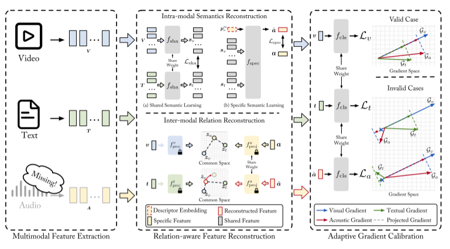

# FakeND-RS: Fake News Detection on short video platform under Realistic Scenarios
Official repository for ["FakeND-RS: Fake News Detection on short video platform under Realistic Scenarios"]

### Introduction
FakeND-RS is a model for detecting real-world fake news short videos. This model is designed to address the challenges posed by missing modalities and invalid modalities in real-world scenarios.

### Environment
Anaconda 4.13.0, python 3.8.5, pytorch 1.10.1 and cuda 11.7. For other libs, please refer to the file requirements.txt.

### Dataset
[FakeSV](https://github.com/ICTMCG/FakeSV)

### Quick Start
You can run our program by the following code:
python main.py --modality_type text option[] --lr option[] --gpu 6 option[]

other detailed settings can be found in `main.py`.

